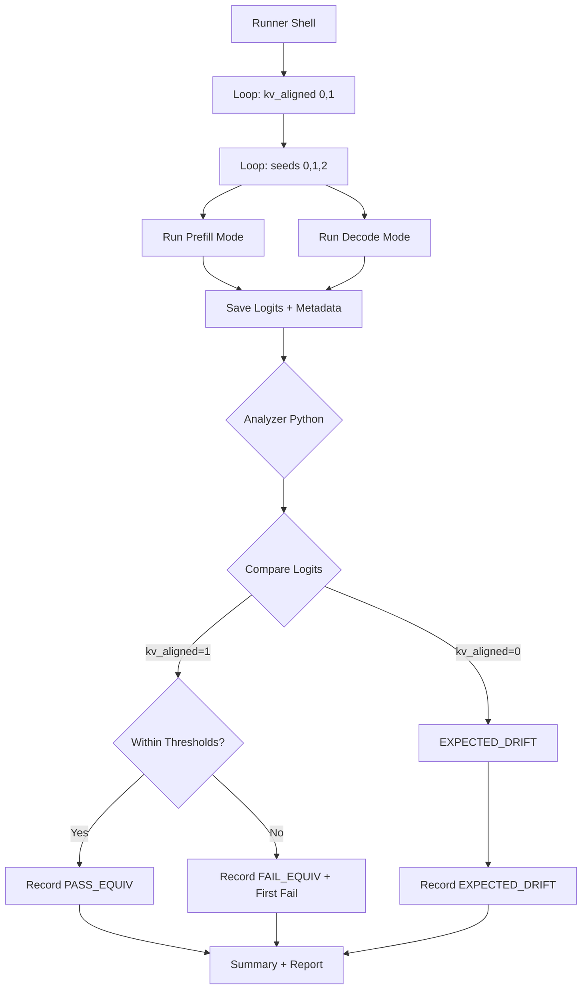

# B3.67 Equivalence Guardrail (Prefill vs Decode)

## Metadata

| Campo | Valor |
|-------|-------|
| **Ticket** | B3.67 |
| **Date** | 2026-02-07 |
| **Author** | L.E.T |
| **Status** | IN_PROGRESS |
| **Labels** | Repo branch: main |
| **Parent** | B3.66, B3.66 v2 |

## Resumen Ejecutivo

Este benchmark implementa un **guardrail de equivalencia** para comparar logits entre modos prefill y decode, con diferentes configuraciones de `kv_aligned`:

- **kv_aligned=1**: Comprobación de equivalencia estricta dentro de umbrales
- **kv_aligned=0**: Drift esperado (semántica prefill vs decode diferente)

B3.66 identificó drift estructural debido a semánticas diferentes entre prefill y decode. B3.67 formaliza este comportamiento con veredictos automatizados.

## Objetivos

1. **Verificar equivalencia numérica** cuando KV está alineado (kv_aligned=1)
2. **Documentar drift esperado** cuando KV no está alineado (kv_aligned=0)
3. **Fail-fast** en caso de drift inesperado en kv_aligned=1
4. **First-fail tracking** para diagnóstico rápido

## Antecedentes

### B3.66 / B3.66 v2

- **Resultado**: EXPECTED por STRUCTURAL_DRIFT (semántica prefill vs decode)
- **Evidencia**: kv_aligned mode agregó claridad sobre alineación de KV
- **Hallazgo**: El drift en atención es esperado cuando prefill usa múltiples tokens vs decode single token

### B3.67 como Guardrail

B3.67 convierte el conocimiento de B3.66 en un guardrail automatizado:
- Si kv_aligned=1 Y drift > umbrales → FAIL (regresión)
- Si kv_aligned=0 → EXPECTED_DRIFT (comportamiento documentado)

## Metodología

### Matriz de Ejecución

| Parámetro | Valores |
|-----------|---------|
| `kv_aligned` | 0, 1 |
| `mode` | prefill, decode |
| `dtype` | bf16 (default) |
| `prompt_len` | 512 (default) |
| `gen_len` | 128 (default) |
| `seeds` | 0, 1, 2 |

### Arquitectura del Benchmark



## Métricas de Logits

### Métricas Computadas (por token)

| Métrica | Descripción |
|---------|-------------|
| `max_abs_diff` | Diferencia absoluta máxima entre logits |
| `p99_abs_diff` | Percentil 99 de diferencias absolutas |
| `top1_agreement` | Porcentaje de tokens donde argmax coincide |
| `cos_sim_mean` | Similaridad coseno promedio (opcional) |

### Umbrales de Equivalencia

| Métrica | Threshold | Condición |
|---------|-----------|-----------|
| `p99_abs_diff` | ≤ 1e-3 | PASS_EQUIV |
| `max_abs_diff` | ≤ 5e-3 | PASS_EQUIV |
| `top1_agreement` | ≥ 0.999 | PASS_EQUIV |

### Veredictos

| kv_aligned | Condición | Veredicto | Acción |
|------------|-----------|-----------|--------|
| 1 | Cumple todos los thresholds | `PASS_EQUIV` | Continuar |
| 1 | No cumple algún threshold | `FAIL_EQUIV` | **FAIL del benchmark** |
| 0 | Cualquier drift | `EXPECTED_DRIFT` | Registrar métricas, continuar |

### Veredicto Global

```
SIEMPRE FAIL si:
  - Cualquier run con kv_aligned=1 tiene verdict FAIL_EQUIV

PASS si:
  - TODOS los runs con kv_aligned=1 tienen verdict PASS_EQUIV

EXPECTED_DRIFT_ONLY si:
  - NO hay runs con kv_aligned=1 (solo drift esperado)
```

## Artifact Structure

```
artifacts_remote/YYYY-MM-DD/b3_67/
├── runs/
│   ├── kv_aligned_0/
│   │   ├── seed_0/
│   │   │   ├── prefill/
│   │   │   │   ├── logits.jsonl.gz
│   │   │   │   └── metadata.json
│   │   │   └── decode/
│   │   │       ├── logits.jsonl.gz
│   │   │       └── metadata.json
│   │   ├── seed_1/
│   │   └── seed_2/
│   └── kv_aligned_1/
│       ├── seed_0/
│       ├── seed_1/
│       └── seed_2/
├── metrics/
│   ├── kv_aligned_0/
│   │   ├── seed_0_metrics.json
│   │   ├── seed_1_metrics.json
│   │   └── seed_2_metrics.json
│   └── kv_aligned_1/
│       ├── seed_0_metrics.json
│       ├── seed_1_metrics.json
│       └── seed_2_metrics.json
├── summary.json
└── B3_67_EQUIVALENCE_GUARDRAIL.md
```

### Formato de Logits

```json
{"token_idx": 0, "token_id": 101, "logits": [0.1, -0.2, 0.3, ...]}
{"token_idx": 1, "token_id": 102, "logits": [0.05, 0.15, -0.1, ...]}
```

### Formato de Metadata

```json
{
  "dtype": "bf16",
  "prompt_len": 512,
  "gen_len": 128,
  "seed": 0,
  "kv_aligned": 1,
  "mode": "prefill",
  "timestamp": "2026-02-07T20:00:00Z",
  "git_commit": "abc123def"
}
```

## Implementación

### Archivos del Benchmark

| Archivo | Descripción |
|---------|-------------|
| `tools/benchmarks/run_b3_67_equivalence_guardrail.sh` | Runner shell |
| `tools/benchmarks/analyze_b3_67_equivalence_guardrail.py` | Analyzer Python |

### Uso del Runner

```bash
# Ejecución completa (todos los valores de kv_aligned)
./tools/benchmarks/run_b3_67_equivalence_guardrail.sh <NODE_IP>

# Solo kv_aligned=1
./tools/benchmarks/run_b3_67_equivalence_guardrail.sh <NODE_IP> --kv_aligned 1

# Con seeds específicos
./tools/benchmarks/run_b3_67_equivalence_guardrail.sh <NODE_IP> --seeds "0,1"
```

### Uso del Analyzer

```bash
python3 tools/benchmarks/analyze_b3_67_equivalence_guardrail.py \
    --traces-dir artifacts_remote/YYYY-MM-DD/b3_67/runs \
    --output artifacts_remote/YYYY-MM-DD/b3_67/B3_67_EQUIVALENCE_GUARDRAIL.md
```

## Flags de Determinismo

Para minimizar flakiness, el runner configura:

```bash
export HIP_LAUNCH_BLOCKING=1        # Síncrono
export AMD_SERIALIZE_KERNEL=3       # Serializar kernels
export HSA_ENABLE_SDMA=0            # Disable SDMA
export GRETA_SEED=${SEED}           # Seed fixed
```

## Resultados Esperados

### kv_aligned=1

| Métrica | Valor Esperado |
|---------|---------------|
| `max_abs_diff` | ≤ 5e-3 |
| `p99_abs_diff` | ≤ 1e-3 |
| `top1_agreement` | ≥ 0.999 |
| **Veredicto** | `PASS_EQUIV` |

### kv_aligned=0

| Métrica | Valor Esperado |
|---------|---------------|
| Drift | Permitido |
| **Veredicto** | `EXPECTED_DRIFT` |

## Interpretación de Resultados

### PASS_GUARDRAIL

- Todos los runs con kv_aligned=1 pasaron equivalencia
- Runs con kv_aligned=0 muestran drift esperado
- **Acción**: Continuar desarrollo

### FAIL_GUARDRAIL

- Al menos un run con kv_aligned=1 falló equivalencia
- **Acción**: Investigar regresión

### EXPECTED_DRIFT_ONLY

- Solo se ejecutaron runs con kv_aligned=0
- Drift documentado y esperado
- **Acción**: Ejecutar con kv_aligned=1 para verificación completa

## Riesgos y Mitigaciones

| Riesgo | Probabilidad | Impacto | Mitigación |
|--------|--------------|---------|------------|
| Variabilidad en seeds | Media | Métricas varían | Seeds fijos + promediar |
| Precision BF16 vs FP32 | Baja | Errores numéricos | Normalizar a float32 |
| Non-determinismo GPU | Baja | Resultados diferentes | Flags de determinismo |
| Paring incorrecto | Media | Comparar tokens wrong | Verificar token_id |
| Archivo corrupto | Baja | Falla de análisis | Validar schema JSON |

## Changelog

| Fecha | Autor | Cambio |
|-------|-------|--------|
| 2026-02-07 | L.E.T | Creación inicial |

## Referencias

- B3.66: Prefill vs Decode Drift Probe
- B3.66 v2: kv_aligned Mode Probe
- docs/PROGRESS.md: Estado del benchmark
