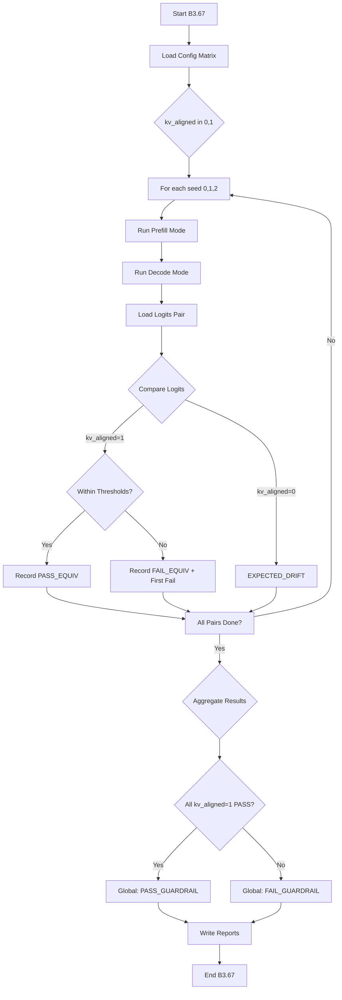

# Diseño B3.67 — Equivalence Guardrail (Prefill vs Decode)

## 1. Layout de Artifacts

```
artifacts_remote/YYYY-MM-DD/b3_67/
├── config.json                    # Configuración del run (matriz de parámetros)
├── runs/
│   ├── kv_aligned_1/
│   │   ├── seed_0/
│   │   │   ├── prefill/
│   │   │   │   ├── logits.jsonl.gz  # Logits para prefill
│   │   │   │   └── metadata.json    # Config: dtype, prompt_len, gen_len, seed
│   │   │   └── decode/
│   │   │       ├── logits.jsonl.gz
│   │   │       └── metadata.json
│   │   ├── seed_1/
│   │   └── seed_2/
│   └── kv_aligned_0/
│       ├── seed_0/
│       │   ├── prefill/
│       │   └── decode/
│       └── ...
├── metrics/
│   ├── kv_aligned_1/
│   │   ├── seed_0_metrics.json    # Métricas por par prefill vs decode
│   │   ├── seed_1_metrics.json
│   │   └── seed_2_metrics.json
│   └── kv_aligned_0/
│       ├── seed_0_metrics.json
│       └── ...
├── summary.json                   # Aggregated metrics + veredicto global
└── B3_67_EQUIVALENCE_GUARDRAIL.md # Reporte final
```

### Archivos mínimos por run

| Archivo | Formato | Descripción |
|---------|---------|-------------|
| `logits.jsonl.gz` | JSONL comprimido | Un objeto JSON por línea con: `{token_idx, logits: [float], token_id}` |
| `metadata.json` | JSON | `{dtype, prompt_len, gen_len, seed, kv_aligned, mode, timestamp}` |
| `metrics.json` | JSON | `{seed, dtype, prompt_len, gen_len, kv_aligned, max_abs_diff, p99_abs_diff, top1_agreement, cos_sim_mean, verdict}` |
| `summary.json` | JSON | `{total_runs, pass_equiv, fail_equiv, expected_drift, first_fail, global_verdict}` |

---

## 2. Contrato Runner ↔ Analyzer

### 2.1 Serialización de Logits

**Formato del archivo de logits**: `logits.jsonl.gz` (JSONLines, gzip comprimido)

```json
{"token_idx": 0, "token_id": 101, "logits": [0.1, -0.2, 0.3, ...]}
{"token_idx": 1, "token_id": 102, "logits": [0.05, 0.15, -0.1, ...]}
```

**Metadata por run**: `metadata.json`

```json
{
  "dtype": "bf16",
  "prompt_len": 512,
  "gen_len": 128,
  "seed": 0,
  "kv_aligned": 1,
  "mode": "prefill|decode",
  "timestamp": "2026-02-07T20:00:00Z",
  "git_commit": "abc123def"
}
```

### 2.2 Métricas serializadas: `metrics.json`

```json
{
  "seed": 0,
  "dtype": "bf16",
  "prompt_len": 512,
  "gen_len": 128,
  "kv_aligned": 1,
  "pair_count": 128,
  "metrics": {
    "max_abs_diff": 0.0023,
    "p99_abs_diff": 0.0012,
    "top1_agreement": 0.9998,
    "cos_sim_mean": 0.99995
  },
  "verdict": "PASS_EQUIV|FAIL_EQUIV|EXPECTED_DRIFT",
  "thresholds": {
    "p99_abs_diff_max": 0.001,
    "max_abs_diff_max": 0.005,
    "top1_agreement_min": 0.999
  },
  "first_fail": null,
  "timestamp": "2026-02-07T20:01:00Z"
}
```

### 2.3 Summary Global: `summary.json`

```json
{
  "benchmark": "B3.67",
  "date": "2026-02-07",
  "config_matrix": {
    "kv_aligned": [0, 1],
    "dtype": ["bf16"],
    "prompt_len": [512],
    "gen_len": [128],
    "seeds": [0, 1, 2]
  },
  "results": {
    "kv_aligned_1": {
      "total_runs": 3,
      "pass_equiv": 3,
      "fail_equiv": 0,
      "metrics_summary": {
        "max_abs_diff_mean": 0.0015,
        "p99_abs_diff_mean": 0.0008,
        "top1_agreement_mean": 0.9999
      }
    },
    "kv_aligned_0": {
      "total_runs": 3,
      "expected_drift": 3,
      "metrics_summary": {
        "max_abs_diff_mean": 0.15,
        "p99_abs_diff_mean": 0.08
      }
    }
  },
  "first_fail": null,
  "global_verdict": "PASS_GUARDRAIL",
  "threshold_config": {
    "p99_abs_diff_max": 0.001,
    "max_abs_diff_max": 0.005,
    "top1_agreement_min": 0.999
  }
}
```

---

## 3. Umbrales y Veredictos

### 3.1 Thresholds (constantes hardcodeadas en analyzer)

```python
THRESHOLDS = {
    "p99_abs_diff_max": 1e-3,      # 0.001
    "max_abs_diff_max": 5e-3,      # 0.005
    "top1_agreement_min": 0.999    # 99.9%
}
```

### 3.2 Lógica de Verdict

```
SI kv_aligned == 1:
    SI p99_abs_diff <= 1e-3 AND max_abs_diff <= 5e-3 AND top1_agreement >= 0.999:
        verdict = "PASS_EQUIV"
    SINO:
        verdict = "FAIL_EQUIV"  # Falla el benchmark

SI kv_aligned == 0:
    verdict = "EXPECTED_DRIFT"  # Drift permitido, registrar métricas
```

### 3.3 Verdict Global

```
SI kv_aligned == 1:
    SI TODOS los runs tienen verdict == "PASS_EQUIV":
        global_verdict = "PASS_GUARDRAIL"
    SINO:
        global_verdict = "FAIL_GUARDRAIL"

SI kv_aligned == 0:
    global_verdict = "EXPECTED_DRIFT"  # Siempre pasa, es drift esperado
```

---

## 4. Riesgos y Mitigaciones (Flakiness)

| Riesgo | Probabilidad | Impacto | Mitigación |
|--------|--------------|---------|------------|
| **Variabilidad en seeds** | Media | Las métricas varían entre seeds | Usar seeds fijos (0,1,2) y promediar; si un seed falla, rerun con mismo seed |
| **Diferencias numéricas en BF16** | Baja | Errores de precisión en float32 vs bf16 | Normalizar a float32 antes de comparar; usar tolerancias relativas |
| **Non-determinismo en GPU** | Baja | Múltiples runs dan resultados diferentes | `set -euo pipefail`, HIP_LAUNCH_BLOCKING=1, disable SDMA |
| **Paring incorrecto prefill vs decode** | Media | Comparar logits de tokens diferentes | Verificar `token_id` y `token_idx` coinciden antes de comparar |
| **Archivo corrupto** | Baja | Logits incompletos o malformados | Validar schema JSON en carga; abortar si falta algún token |
| **Gzip corrupto** | Baja | Error al descomprimir | Verificar integridad con `gzip -t` antes de cargar |

### Flags de determinismo para el Runner

```bash
export HIP_LAUNCH_BLOCKING=1        # Síncrono
export AMD_SERIALIZE_KERNEL=3       # Serializar kernels
export HSA_ENABLE_SDMA=0            # Disable SDMA
export GRETA_SEED=${SEED}           # Seed fixed
export GRETA_DETERMINISTIC=1        # Modo determinístico
```

---

## 5. Plan de Implementación Paso a Paso

### Fase 1: Crear archivos base del benchmark

- [ ] Crear `tools/benchmarks/run_b3_67_equivalence_guardrail.sh`
  - [ ] Parámetros: `NODE_IP`, `DATE`, `kv_aligned`, `mode`, `seed`, `dtype`, `prompt_len`, `gen_len`
  - [ ] Lock file exclusivo
  - [ ] Sync repo, build, setup dirs
  - [ ] Loop por seeds y kv_aligned
  - [ ] Invocar greta_infer con flags correctos
  - [ ] Empaquetar artifacts y sincronizar a local

- [ ] Crear `tools/benchmarks/analyze_b3_67_equivalence_guardrail.py`
  - [ ] `ArgumentParser` con `--traces-dir`, `--output`
  - [ ] `load_logits(dir)` - carga logits.jsonl.gz y metadata.json
  - [ ] `compute_metrics(prefill_logits, decode_logits)` - max_abs_diff, p99_abs_diff, top1_agreement
  - [ ] `evaluate_verdict(metrics, kv_aligned)` - PASS_EQUIV / FAIL_EQUIV / EXPECTED_DRIFT
  - [ ] `generate_summary(all_metrics)` - aggregation y veredicto global
  - [ ] `write_reports(summary, output_path)` - summary.md + metrics.json + summary.json

### Fase 2: Integración con infraestructura existente

- [ ] Copiar estructura de prompts de B3.66 (p0_short, p6_len_16, etc.) o usar prompts parametrizados
- [ ] Asegurar que `greta_infer` soporte flags para kv_aligned y mode (prefill/decode)
- [ ] Verificar que el modulo de tracing exporte logits correctamente

### Fase 3: Documentación

- [ ] Crear `docs/AMD/2026_02_07_B3_67_equivalence_guardrail.md`
  - [ ] Objetivo del benchmark
  - [ ] Metodología
  - [ ] Matriz de ejecución
  - [ ] Resultados esperados
  - [ ] Interpretación de veredictos

- [ ] Actualizar `docs/PROGRESS.md` con entrada B3.67
  - [ ] Status: IN_PROGRESS
  - [ ] Labels estables: Repo branch: main

### Fase 4: Testing y validación

- [ ] Test local con datos sintéticos (sin GPU)
- [ ] Test en remoto MI300X con kv_aligned=1 (debe pasar)
- [ ] Test en remoto MI300X con kv_aligned=0 (debe dar EXPECTED_DRIFT)
- [ ] Verificar que FAIL_EQUIV realmente falla el benchmark

---

## 6. Diagrama de Flujo del Benchmark



---

## 7. Dependencias

- Python 3.8+
- numpy (para cómputo de métricas)
- gzip (standard library)
- json (standard library)
- statistics (standard library)

**No se agregan dependencias nuevas** - solo libraries estándar de Python.

---

## 8. Métricas de Logits (detalle)

### max_abs_diff

```python
def max_abs_diff(logits_a, logits_b):
    diffs = np.abs(np.array(logits_a) - np.array(logits_b))
    return float(np.max(diffs))
```

### p99_abs_diff

```python
def p99_abs_diff(logits_a, logits_b):
    diffs = np.abs(np.array(logits_a) - np.array(logits_b))
    return float(np.percentile(diffs, 99))
```

### top1_agreement

```python
def top1_agreement(logits_a, logits_b):
    argmax_a = np.argmax(logits_a)
    argmax_b = np.argmax(logits_b)
    return float(argmax_a == argmax_b)
```

### cos_sim_mean (opcional)

```python
def cos_sim_mean(logits_a, logits_b):
    a = np.array(logits_a)
    b = np.array(logits_b)
    cos_sim = np.dot(a, b) / (np.linalg.norm(a) * np.linalg.norm(b))
    return float(cos_sim)
```

---

## 9. Acciones Requeridas del Lado del Engine (greta_infer)

Para que B3.67 funcione, `greta_infer` necesita:

1. **Flag `--kv-aligned`** que active/desactive alineación de KV
2. **Flag `--mode prefill|decode`** que seleccione el modo de ejecución
3. **Output de logits** en formato JSONL gzip (para tokens generados)
4. **Metadata incluida** con cada logits line

Esto puede requerir cambios mínimos en el engine existente (similar a B3.66).

---

## 10. Checklist de Implementación

### Archivos a crear

- [ ] `tools/benchmarks/run_b3_67_equivalence_guardrail.sh`
- [ ] `tools/benchmarks/analyze_b3_67_equivalence_guardrail.py`
- [ ] `docs/AMD/2026_02_07_B3_67_equivalence_guardrail.md`
- [ ] Update `docs/PROGRESS.md`

### Archivos a modificar (mínimo)

- [ ] Ninguno (reutilizar patrones B3.66 sin cambios invasivos)
- [ ] Si `greta_infer` necesita flags nuevos, crear PR separado

### Validación

- [ ] Shell script con `set -euo pipefail`
- [ ] Python script sin dependencias nuevas
- [ ] Artifacts naming estable y parseable
- [ ] Veredictos según especificación
- [ ] First-fail tracking funciona
